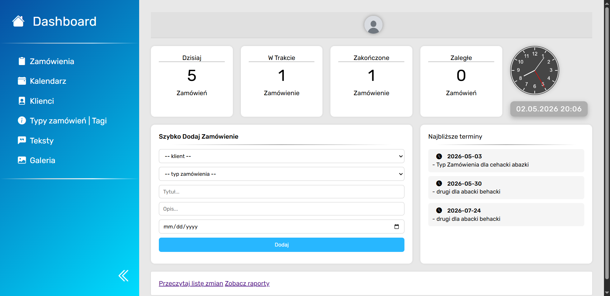

> [Strona Główna](../README.md)

# Dashboard



Podstrona pełni rolę głównego panelu administracyjnego aplikacji do zarządzania zamówieniami. Dashboard agreguje najważniejsze informacje systemowe oraz umożliwia szybki dostęp do kluczowych funkcji aplikacji.

Użytkownik po zalogowaniu może:

- sprawdzić status zamówień,
- wyświetlić najbliższe terminy realizacji,
- szybko dodać nowe zamówienie,
- przejść do innych modułów systemu,
- sprawdzić aktualną datę i godzinę,
- monitorować stan autoryzacji użytkownika.

---

## 1. Struktura HTML

### 1.1 Sekcja `<head>`

W sekcji `head` znajdują się:

#### Import biblioteki ikon Bootstrap Icons

```html
<link
  rel="stylesheet"
  href="https://cdn.jsdelivr.net/npm/bootstrap-icons@1.11.0/font/bootstrap-icons.css"
/>
```

Biblioteka odpowiada za wyświetlanie ikon używanych w interfejsie użytkownika.

#### Import pliku CSS

```html
<link rel="stylesheet" href="style.css" />
```

Plik zawiera style całego dashboardu.

#### Import fontu Rubik

```html
<link
  href="https://fonts.googleapis.com/css2?family=Rubik:ital,wght@0,300..900;1,300..900&display=swap"
  rel="stylesheet"
/>
```

Font Rubik jest używany jako główna czcionka aplikacji.

---

### 2. Nawigacja boczna (`aside`)

Sekcja:

```html
<aside id="dashboard-navbar"></aside>
```

odpowiada za menu boczne aplikacji.

#### Funkcje menu:

- przejście do strony głównej,
- przejście do modułu zamówień,
- przejście do kalendarza,
- przejście do klientów,
- przejście do typów zamówień i tagów,
- przejście do tekstów,
- przejście do galerii.

#### Mechanizm zwijania menu

Element:

```html
<i
  class="bi bi-chevron-double-left"
  id="dashboard-toggle-visibility"
  onclick="toggleDashboardNavbar()"
></i>
```

wywołuje funkcję `toggleDashboardNavbar()`, która odpowiada za ukrywanie lub pokazywanie panelu bocznego.

Funkcja została zaimplementowana w pliku `script.js`.

---

### 3. Główna zawartość strony (`main`)

#### 3.1 Sekcja użytkownika

```html
<div id="user-section"></div>
```

Wyświetla:

- status użytkownika,
- avatar użytkownika.

Kliknięcie avatara:

```javascript
$("#user-avatar").on("click", function () {
  window.location.href = "logowanie/index.html";
});
```

powoduje przejście do modułu logowania.

---

### 4. Mechanizm autoryzacji użytkownika

#### Funkcja `checkAuth()`

```javascript
async function checkAuth() {
```

Funkcja sprawdza stan autoryzacji użytkownika poprzez żądanie:

```javascript
fetch("logowanie/api/auth.php");
```

##### Możliwe odpowiedzi serwera:

| Kod HTTP | Znaczenie                |
| -------- | ------------------------ |
| 401      | użytkownik niezalogowany |
| 403      | konto zablokowane        |
| 200      | użytkownik zalogowany    |

#### Funkcja `init()`

Funkcja uruchamiana podczas startu aplikacji.

Odpowiada za:

- sprawdzenie autoryzacji,
- przekierowanie do logowania,
- blokadę dostępu dla nieaktywnych kont,
- inicjalizację danych dashboardu.

##### Fragment odpowiedzialny za przekierowanie:

```javascript
if (res.status === 401) {
  window.location.href = "logowanie/index.html";
  return;
}
```

---

### 5. Zegar analogowy Canvas

Dashboard zawiera zegar analogowy renderowany przy pomocy elementu:

```html
<canvas id="clock" width="300" height="300"></canvas>
```

#### Funkcja `drawClock()`

Funkcja odpowiada za:

- rysowanie tarczy,
- generowanie cyfr 1–12,
- rysowanie wskazówek,
- aktualizację czasu.

##### Aktualizacja zegara

```javascript
setInterval(drawClock, 1000);
```

Zegar odświeżany jest co 1 sekundę.

#### Wykorzystane elementy Canvas API

- `ctx.arc()` – rysowanie okręgu,
- `ctx.fill()` – wypełnienie tarczy,
- `ctx.stroke()` – rysowanie obramowań,
- `ctx.rotate()` – obracanie elementów,
- `ctx.fillText()` – wyświetlanie numerów godzin.

---

### 6. Statystyki zamówień

Dashboard wyświetla liczbę:

- dzisiejszych zamówień,
- zamówień w realizacji,
- zamówień zakończonych,
- zaległych zamówień.

#### Pobieranie danych

Dane pobierane są metodą `fetch()` z endpointów API:

```javascript
api / get_today_orders_count.php;
api / get_orders_count.php;
api / get_old_orders_count.php;
```

#### Obsługa błędów

Każde zapytanie posiada obsługę błędów:

```javascript
.catch((err) => {
  console.error(err);
});
```

---

### 7. Funkcja odmiany języka polskiego

#### Funkcja `getPolishEnding()`

Funkcja odpowiada za poprawną odmianę słowa „zamówienie”.

##### Przykłady:

| Liczba | Wynik      |
| ------ | ---------- |
| 1      | zamówienie |
| 2      | zamówienia |
| 5      | zamówień   |

#### Implementacja

```javascript
function getPolishEnding(number, originalEnding)
```

Funkcja wykorzystuje instrukcję `switch` oraz analizę wartości liczbowych.

---

### 8. Najbliższe terminy realizacji

Sekcja:

```html
<div id="closest-orders-container"></div>
```

wyświetla zamówienia o najbliższym terminie realizacji.

#### Endpoint API

```javascript
api / get_closest_orders.php;
```

#### Dynamiczne generowanie elementów

Każde zamówienie jest dodawane metodą:

```javascript
closestOrdersDiv.append();
```

#### Obsługa kliknięcia

```javascript
$("#closest-orders-container").on(
  "click",
  ".closest-order",
  function () {
```

Po kliknięciu użytkownik zostaje przekierowany do widoku szczegółowego zamówienia.

---

### 9. Szybkie dodawanie zamówienia

Sekcja umożliwia utworzenie zamówienia bez przechodzenia do pełnego formularza.

#### Formularz

```html
<form id="fast-add-order-form"></form>
```

#### Pola formularza

| Pole           | Opis              |
| -------------- | ----------------- |
| klient         | wybór klienta     |
| typ zamówienia | wybór typu        |
| tytuł          | nazwa zamówienia  |
| opis           | opis zamówienia   |
| data           | termin realizacji |

---

### 10. Ładowanie danych formularza

#### Typy zamówień

Dane pobierane z endpointu:

```javascript
fetch("typy_tagi/api/get_all_types.php");
```

#### Lista klientów

Dane pobierane z:

```javascript
fetch("klienci/api/list.php");
```

##### Sortowanie klientów

```javascript
data.sort((a, b) => a.nazwisko.localeCompare(b.nazwisko, "pl"));
```

Sortowanie odbywa się alfabetycznie według nazwiska.

---

### 11. Walidacja formularza

Przed wysłaniem formularza wykonywana jest walidacja:

#### Sprawdzane warunki

- czy wybrano klienta,
- czy podano tytuł,
- czy wybrano typ zamówienia,
- poprawność identyfikatorów liczbowych.

#### Przykład walidacji

```javascript
if (selectedClient === "") {
  $("#fast-order-error").text("Podaj klienta");
  return;
}
```

---

### 12. Dodawanie zamówienia

#### Endpoint API

```javascript
api / fast_add_order.php;
```

#### Metoda HTTP

```javascript
POST;
```

#### Format danych

```javascript
body: JSON.stringify({
  clientId,
  typeId,
  description,
  date,
  title,
});
```

#### Po poprawnym dodaniu

Użytkownik zostaje przekierowany do modułu zamówień:

```javascript
window.location.href = "zamowienia/index.html";
```

---

### 13. Zegar cyfrowy

Funkcja:

```javascript
function loadTimer()
```

odpowiada za wyświetlanie:

- aktualnej daty,
- aktualnej godziny.

#### Format daty

```text
DD.MM.RRRR HH:MM
```

#### Automatyczna aktualizacja

```javascript
setTimeout(() => loadTimer(), 10000);
```

Odświeżanie następuje co 10 sekund.

---

### 14. Architektura komunikacji

Frontend komunikuje się z backendem poprzez endpointy API zwracające dane JSON.

Schemat działania:

```text
Frontend → fetch() → API PHP → Baza danych → JSON → Frontend
```

---

## 2. Moduł `update_manager.js`

### Cel modułu

Plik `update_manager.js` odpowiada za sprawdzanie dostępności aktualizacji aplikacji poprzez porównanie lokalnej wersji systemu z wersją opublikowaną w repozytorium GitHub.

---

### Mechanizm działania

System wykorzystuje dwa pliki tekstowe:

| Plik                    | Funkcja                        |
| ----------------------- | ------------------------------ |
| `version.txt` (lokalny) | aktualnie zainstalowana wersja |
| `version.txt` (GitHub)  | najnowsza dostępna wersja      |

---

### Pobieranie wersji zdalnej

Funkcja:

```javascript id="f7i7hu"
getRemoteVersion();
```

pobiera numer najnowszej wersji z repozytorium GitHub przy użyciu `fetch()`.

Źródło:

```javascript id="7a5xg5"
https://raw.githubusercontent.com/SpacingKosmopan/NowySystemZamowien/main/version.txt
```

---

### Pobieranie wersji lokalnej

Funkcja:

```javascript id="3m7pov"
getLocalVersion();
```

odczytuje lokalny plik `version.txt` znajdujący się w katalogu aplikacji.

---

### Sprawdzanie aktualizacji

Funkcja:

```javascript id="7f03cm"
checkUpdate();
```

porównuje:

- lokalną wersję aplikacji,
- wersję zdalną.

Porównanie wykonywane jest po usunięciu białych znaków metodą:

```javascript id="g6c0c2"
trim();
```

---

### Informowanie użytkownika

Po wykryciu nowej wersji system wyświetla komunikat:

```text id="whgt8x"
Dostępna jest aktualizacja!
```

Informacja renderowana jest w elemencie:

```html id="xh0hbm"
#upd-text
```

---

### Obsługa błędów

Każda operacja `fetch()` posiada obsługę wyjątków:

```javascript id="90n1o2"
try/catch
```

Błędy są logowane do konsoli przeglądarki.

---

## 3. Moduł ustawień (`settings.html`)

Moduł umożliwia personalizację kolorystyki aplikacji poprzez konfigurację kolorów statusów zamówień i kalendarza.

---

### 2. Funkcjonalność modułu

#### Konfigurowane elementy

##### Kalendarz

- nowe zamówienie,
- zrealizowane,
- w realizacji,
- anulowane,
- zaległe.

##### Zamówienia

- nowe,
- zrealizowane,
- w realizacji,
- anulowane.

---

### 3. System trwałego zapisu ustawień

#### Mechanizm działania

Ustawienia zapisywane są do pliku:

```text
colors.json
```

Komunikacja odbywa się przez endpoint:

```text
/api/filesystem.php
```

---

### 4. Architektura API filesystem

#### Operacje API

| Operacja | Opis         |
| -------- | ------------ |
| save     | zapis pliku  |
| load     | odczyt pliku |

---

### 5. Zapis ustawień

#### Funkcja

```javascript
saveColorsToFile();
```

odpowiada za:

- pobranie danych z formularza,
- serializację do JSON,
- wysłanie danych do backendu.

#### Format danych

```json
{
  "calNew": "#ffe29a",
  "calDone": "#98ff9d"
}
```

---

### 6. Odczyt ustawień

#### Funkcja

```javascript
loadColorsFromFile();
```

odpowiada za:

- pobranie danych z pliku,
- parsowanie JSON,
- ustawienie wartości pól formularza.

---

### 7. Domyślna konfiguracja

System posiada fallback defaults:

```javascript
const defaultColorsData = {
```

W przypadku braku pliku konfiguracyjnego system wykorzystuje domyślne wartości kolorów zapisane po stronie frontendowej.

---

### 8. Persystencja ustawień

System:

- zapisuje konfigurację,
- odczytuje ją po restarcie,
- utrzymuje stan aplikacji.
  Tutaj dokumentacja powinna być już bardzo krótka, bo ten moduł jest prosty i robi jedną rzecz.

Ale są 2 rzeczy, które są naprawdę ważne technicznie:

- dynamiczny rendering Markdown,
- renderowanie HTML z zewnętrznego pliku.

To już jest coś więcej niż zwykły statyczny HTML.

---

## 4. Moduł changeloga (`changelog.html`)

Moduł odpowiada za wyświetlanie historii zmian aplikacji w formacie Markdown.

---

## 2. Źródło danych

Treść changeloga pobierana jest z pliku:

```text id="rjx9r2"
changelog.md
```

Plik zawiera historię zmian projektu w formacie Markdown.

---

## 3. Dynamiczne renderowanie Markdown

### Mechanizm działania

1. Frontend pobiera plik `.md` metodą `fetch()`
2. Zawartość konwertowana jest do HTML
3. HTML renderowany jest w kontenerze strony

---

## 4. Biblioteka `marked.js`

Aplikacja wykorzystuje bibliotekę:

```html id="4v4xq0"
https://cdn.jsdelivr.net/npm/marked/marked.min.js
```

Biblioteka odpowiada za konwersję Markdown → HTML.

---

## 5. Funkcja `loadMd()`

### Odpowiedzialność funkcji

```javascript id="i9d89j"
async function loadMd()
```

Funkcja:

- pobiera plik Markdown,
- parsuje zawartość,
- renderuje HTML w interfejsie użytkownika.

---

## 6. Renderowanie treści

Wygenerowany HTML umieszczany jest w elemencie:

```html id="m91m2g"
#changelog-content
```

przy użyciu:

```javascript id="ryv7d7"
$("#changelog-content").html(html);
```

---

## 7. Stylowanie Markdown

Do formatowania treści wykorzystywany jest plik:

```text id="2uw8sv"
markdown.css
```

oraz klasa:

```html id="dfszpo"
markdown-body
```
