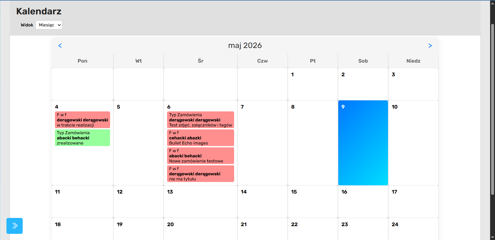

# Moduł „Kalendarz”



## Opis modułu

Moduł „Kalendarz” odpowiada za wizualne przedstawienie terminów realizacji zamówień zapisanych w systemie. Użytkownik może przeglądać zamówienia w formie kalendarza oraz przełączać się pomiędzy widokami:

- miesięcznym,
- tygodniowym,
- dziennym.

Każde wydarzenie reprezentuje konkretne zamówienie zapisane w bazie danych.

---

## Struktura podstrony

Podstrona składa się z kilku głównych sekcji.

---

## Panel nawigacyjny

Lewa część interfejsu zawiera panel boczny umożliwiający przechodzenie pomiędzy modułami systemu:

- Dashboard,
- Zamówienia,
- Kalendarz,
- Klienci,
- Typy zamówień i tagi,
- Teksty,
- Galeria.

Panel wykorzystuje:

- Bootstrap Icons,
- wspólne style aplikacji,
- mechanizm zwijania i rozwijania menu.

---

## Sekcja główna

Sekcja główna zawiera:

- nagłówek strony,
- wybór typu widoku kalendarza,
- siatkę kalendarza,
- przyciski nawigacji pomiędzy datami.

---

## Typy widoku kalendarza

Użytkownik może przełączać widok przy pomocy pola:

```html
<select id="view-type"></select>
```

Dostępne tryby:

| Wartość | Widok   |
| ------- | ------- |
| m       | miesiąc |
| w       | tydzień |
| d       | dzień   |

Zmiana widoku powoduje dynamiczne przebudowanie kalendarza.

---

## Autoryzacja użytkownika

Po załadowaniu strony wykonywana jest funkcja:

```js
init();
```

Frontend wysyła zapytanie:

```js
fetch("../logowanie/api/auth.php");
```

Backend PHP sprawdza:

- aktywną sesję,
- status użytkownika.

Jeżeli użytkownik nie jest zalogowany lub konto jest nieaktywne, zwracany jest kod:

```http
401 Unauthorized
```

lub:

```http
403 Forbidden
```

---

## Ładowanie danych zamówień

Po poprawnej autoryzacji wykonywana jest funkcja:

```js
loadData();
```

System pobiera dane kalendarza z endpointu:

```js
fetch("fetch_orders.php");
```

Backend PHP pobiera z bazy danych:

- terminy realizacji,
- statusy zamówień,
- dane klientów,
- tytuły zamówień.

Dane zwracane są w formacie JSON.

---

## Struktura danych wydarzeń

Dane organizowane są według dat:

```js
eventsData[dateKey];
```

Każda data zawiera listę wydarzeń przypisanych do konkretnego dnia.

Przykładowe dane wydarzenia:

| Pole             | Opis                     |
| ---------------- | ------------------------ |
| id               | identyfikator zamówienia |
| klient           | nazwa klienta            |
| tytul            | typ zamówienia           |
| tytul_zamowienia | tytuł zamówienia         |
| status           | status realizacji        |
| data             | termin realizacji        |

---

## Renderowanie kalendarza

System dynamicznie generuje widok kalendarza przy pomocy JavaScript.

Główna funkcja:

```js
renderCalendarView();
```

na podstawie wybranego trybu wywołuje:

| Funkcja           | Zastosowanie   |
| ----------------- | -------------- |
| renderMonthView() | widok miesiąca |
| renderWeekView()  | widok tygodnia |
| renderDayView()   | widok dnia     |

---

## Widok miesiąca

Widok miesięczny:

- generuje siatkę 7 kolumn,
- wyświetla dni tygodnia,
- wyświetla wszystkie dni miesiąca,
- umieszcza wydarzenia w odpowiednich komórkach.

System oblicza:

- pierwszy dzień miesiąca,
- liczbę dni,
- przesunięcie początku tygodnia.

Wykorzystywane są obiekty:

```js
new Date();
```

---

## Widok tygodnia

Widok tygodniowy:

- wyświetla 7 kolejnych dni,
- oblicza początek tygodnia,
- renderuje wydarzenia dla każdego dnia.

Początek tygodnia ustawiany jest na poniedziałek.

---

## Widok dnia

Widok dzienny:

- pokazuje pojedynczy dzień,
- wyświetla wszystkie wydarzenia przypisane do tej daty,
- pozwala łatwo przeglądać szczegóły zamówień.

---

## Wyświetlanie wydarzeń

Za renderowanie wydarzeń odpowiada funkcja:

```js
displayEventsForDay();
```

Dla każdego wydarzenia tworzony jest element HTML zawierający:

- typ zamówienia,
- nazwę klienta,
- tytuł zamówienia.

---

## Kolorowanie statusów zamówień

Każde wydarzenie otrzymuje klasę CSS zależną od statusu.

Przykładowe klasy:

| Status       | Klasa CSS          |
| ------------ | ------------------ |
| nowe         | nowe-event         |
| w realizacji | w-realizacji-event |
| zrealizowane | zrealizowane-event |
| anulowane    | anulowane-event    |

---

## Obsługa zaległych zamówień

System wykrywa zaległe zamówienia.

Jeżeli:

- termin realizacji jest wcześniejszy niż aktualna data,
- status nie jest:
  - anulowane,
  - zrealizowane,

wydarzenie otrzymuje klasę:

```css
zalegle-event
```

Pozwala to wizualnie oznaczyć przeterminowane zamówienia.

---

## Przechodzenie do zamówienia

Kliknięcie wydarzenia powoduje przejście do szczegółów zamówienia:

```js
window.location.href = `../zamowienia/index.html?id=${orderId}&isViewOnly=true`;
```

Zamówienie otwierane jest w trybie podglądu.

---

## Nawigacja pomiędzy datami

System umożliwia zmianę zakresu dat przy pomocy przycisków:

| Przycisk | Funkcja         |
| -------- | --------------- |
| <        | poprzedni okres |
| >        | następny okres  |

Działanie zależy od aktywnego widoku:

| Widok   | Zmiana      |
| ------- | ----------- |
| miesiąc | +/- miesiąc |
| tydzień | +/- 7 dni   |
| dzień   | +/- 1 dzień |

---

## Dynamiczna manipulacja DOM

JavaScript dynamicznie tworzy elementy:

- dni,
- wydarzenia,
- nagłówki,
- siatki kalendarza.

Wykorzystywane są:

```js
document.createElement();
```

oraz:

```js
appendChild();
```
