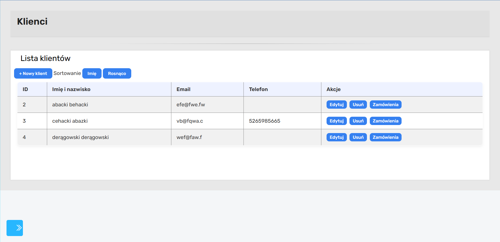
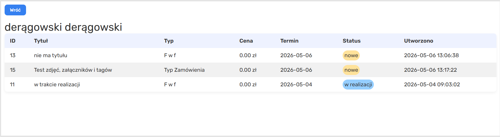

# Moduł „Klienci”



## Opis modułu

Moduł „Klienci” odpowiada za zarządzanie bazą klientów w systemie. Umożliwia:

- wyświetlanie listy klientów,
- dodawanie nowych klientów,
- edycję danych klienta,
- usuwanie klientów,
- przechodzenie do listy zamówień przypisanych do konkretnego klienta.

---

## Struktura podstrony klientów

Podstrona składa się z kilku głównych sekcji:

### 1. Panel boczny (sidebar)

Lewa część interfejsu zawiera menu nawigacyjne umożliwiające przechodzenie pomiędzy modułami systemu:

- Dashboard,
- Zamówienia,
- Kalendarz,
- Klienci,
- Typy zamówień i tagi,
- Teksty,
- Galeria.

Menu wykorzystuje ikony Bootstrap Icons oraz wspólny arkusz stylów aplikacji.

---

### 2. Sekcja główna

Główna część strony zawiera:

- nagłówek strony,
- przyciski sterujące,
- dynamicznie generowaną tabelę klientów,
- formularze dodawania i edycji klienta.

---

## Autoryzacja użytkownika

Po wejściu na stronę wykonywana jest funkcja `init()`.

System wysyła zapytanie:

```js
fetch("../logowanie/api/auth.php");
```

Backend PHP sprawdza aktywną sesję użytkownika.

Jeżeli użytkownik:

- nie jest zalogowany,
- posiada konto zablokowane,
- nie posiada aktywnej sesji,

system zwraca kod:

```http
401 Unauthorized
```

lub:

```http
403 Forbidden
```

W przeciwnym przypadku ładowane są dane klientów.

---

## Renderowanie listy klientów

Lista klientów pobierana jest z backendu przy pomocy funkcji:

```js
renderClients();
```

Frontend wysyła zapytanie:

```js
fetch("api/list.php");
```

Backend PHP:

- pobiera dane z tabeli `klienci`,
- zwraca dane w formacie JSON.

Przykładowe pola klienta:

- id,
- imię,
- nazwisko,
- email,
- telefon,
- adres.

---

## Dynamiczne generowanie tabeli

Tabela klientów tworzona jest dynamicznie w JavaScript.

Każdy rekord zawiera:

| Kolumna         | Opis                  |
| --------------- | --------------------- |
| ID              | identyfikator klienta |
| Imię i nazwisko | dane klienta          |
| Email           | adres email           |
| Telefon         | numer telefonu        |
| Akcje           | operacje na rekordzie |

---

## Sortowanie klientów

System umożliwia sortowanie klientów według:

- imienia,
- nazwiska.

Dostępne kierunki sortowania:

- rosnąco,
- malejąco.

Sortowanie wykonywane jest po stronie JavaScript przy użyciu:

```js
clients.sort(...)
```

Zmiana parametrów sortowania powoduje ponowne wyrenderowanie tabeli.

---

## Dodawanie klienta

Kliknięcie przycisku:

```html
+ Nowy klient
```

powoduje wygenerowanie formularza dodawania klienta.

Formularz zawiera pola:

- imię,
- nazwisko,
- email,
- telefon,
- adres.

Po wysłaniu formularza:

```js
fetch("api/create.php");
```

dane przesyłane są metodą POST w formacie JSON.

Backend PHP:

- odczytuje dane przy pomocy:

```php
json_decode(file_get_contents("php://input"), true)
```

- wykonuje zapytanie INSERT,
- zapisuje klienta w bazie danych.

---

## Edycja klienta

Przycisk:

```html
Edytuj
```

uruchamia formularz edycji.

System:

1. pobiera dane klienta z backendu,
2. uzupełnia formularz aktualnymi wartościami,
3. po zapisaniu wysyła dane do:

```js
api / update.php;
```

Backend wykonuje operację UPDATE w bazie danych.

---

## Usuwanie klienta

Przycisk:

```html
Usuń
```

uruchamia okno potwierdzenia:

```js
confirm("Na pewno usunąć?");
```

Po zatwierdzeniu:

- frontend wysyła żądanie DELETE,
- backend usuwa rekord klienta z bazy danych.

---

## Przechodzenie do zamówień klienta

Każdy klient posiada przycisk:

```html
Zamówienia
```

Kliknięcie powoduje przejście do podstrony:

```txt
zamowienia/index.html?id=ID_KLIENTA
```

Identyfikator klienta przekazywany jest przez parametry URL.

---

## Podstrona „Zamówienia klienta”



### Cel podstrony

Podstrona umożliwia:

- wyświetlenie wszystkich zamówień przypisanych do konkretnego klienta,
- podgląd statusów zamówień,
- przejście do szczegółów wybranego zamówienia.

---

## Pobieranie klienta z adresu URL

Id klienta pobierane jest przy pomocy:

```js
const params = new URLSearchParams(window.location.search);
```

Następnie wykonywane jest:

```js
showOrders(params.get("id"));
```

---

## Pobieranie danych klienta

Frontend wysyła zapytanie:

```js
fetch(`../api/get.php?id=${clientId}`);
```

Backend zwraca dane klienta w formacie JSON.

Dane wyświetlane są nad tabelą zamówień.

---

## Pobieranie zamówień klienta

System pobiera listę zamówień:

```js
fetch(`../api/orders.php?id=${clientId}`);
```

Backend wykonuje zapytanie SQL pobierające wszystkie zamówienia przypisane do klienta.

Najczęściej wykorzystywane pola:

| Pole              | Opis                     |
| ----------------- | ------------------------ |
| id                | identyfikator zamówienia |
| tytul             | nazwa zamówienia         |
| typ               | typ zamówienia           |
| kwota             | wartość zamówienia       |
| termin_realizacji | termin realizacji        |
| status            | aktualny status          |
| data_utworzenia   | data utworzenia          |

---

## Renderowanie tabeli zamówień

Tabela generowana jest dynamicznie.

Każdy wiersz reprezentuje jedno zamówienie.

W przypadku braku danych wyświetlany jest komunikat:

```txt
Brak zamówień
```

---

## Kolorowanie statusów

Statusy zamówień analizowane są przez funkcję:

```js
getStatusClass(status);
```

System przypisuje klasy CSS:

| Status       | Klasa CSS          |
| ------------ | ------------------ |
| nowe         | status-new         |
| w realizacji | status-in-progress |
| zrealizowane | status-done        |
| anulowane    | status-cancel      |

Pozwala to na wizualne oznaczenie stanu zamówienia.

---

## Podgląd konkretnego zamówienia

Kliknięcie w wiersz tabeli powoduje przejście do modułu zamówień:

```js
window.location.href = `../../zamowienia/index.html?id=${order.id}&isViewOnly=true`;
```

System otwiera formularz zamówienia w trybie podglądu.
