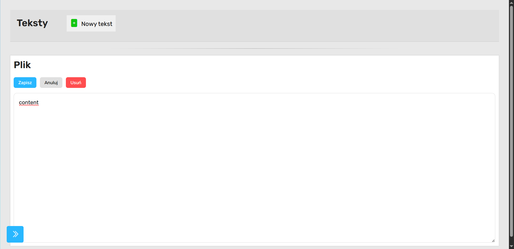

> [Strona Główna](../README.md)

# Strona pojedynczego tekstu



## Opis podstrony

Podstrona odpowiada za:

- wyświetlanie pojedynczego tekstu,
- edycję treści,
- zapis zmian,
- anulowanie edycji,
- usuwanie tekstu,
- kontrolę autoryzacji użytkownika.

Jest to edytor pojedynczego dokumentu znajdującego się w module „Teksty”.

Podstrona działa w oparciu o:

- PHP,
- MySQL,
- JavaScript,
- Fetch API,
- sesje PHP.

---

## Struktura strony

### Sekcja `<head>`

Dołączane są:

#### Style

```html
<link rel="stylesheet" href="../../style.css" />
<link rel="stylesheet" href="../teksty.css" />
```

#### Biblioteki

- Bootstrap Icons
- Google Fonts (Rubik)

---

## Navbar

Lewy panel nawigacyjny:

```html
<aside id="dashboard-navbar"></aside>
```

umożliwia przechodzenie pomiędzy modułami dashboardu.

Obsługuje również zwijanie menu:

```html
toggleDashboardNavbar()
```

Funkcja znajduje się w globalnym `script.js`.

---

## Główna sekcja strony

### Header

```html
<header></header>
```

Zawiera:

- nazwę modułu,
- przycisk „Nowy tekst”,
- breadcrumbs.

---

## Backend PHP

Ta podstrona różni się od wcześniejszych modułów.

Tutaj render HTML wykonywany jest częściowo po stronie PHP.

To ważna różnica architektoniczna.

---

## Autoryzacja użytkownika

### Session check

```php
session_start();

if (!isset($_SESSION['user_id']))
```

Jeżeli użytkownik nie jest zalogowany:

```php
http_response_code(401);
```

oraz:

```php
echo json_encode(["error" => "NOT_LOGGED"]);
```

następuje przerwanie działania:

```php
exit;
```

---

## Pobieranie ID tekstu

```php
$tekst_id = $_GET['id'] ?? null;
```

ID pobierane jest z parametru GET.

Przykład:

```text
tekst/index.php?id=5
```

---

## Walidacja ID

Jeżeli ID nie istnieje:

```php
echo "<h1>Błąd: Brak ID tekstu</h1>";
```

strona nie renderuje edytora.

---

## Połączenie z bazą danych

```php
require '../api/db.php';
```

Ładowane jest połączenie MySQL.

---

## Pobieranie danych tekstu

### Zapytanie SQL

```sql
SELECT t.id, t.tytul, t.tresc, t.struktura_id, s.rodzic_id
FROM teksty t
JOIN struktury s ON t.struktura_id = s.id
WHERE t.id = ?
```

---

## Co pobiera query?

### Dane tekstu

- ID tekstu
- tytuł
- treść
- ID struktury

### Dane folderu

- rodzic_id

Pozwala to wrócić później do poprzedniego katalogu.

---

## Prepared statements

Kod poprawnie używa:

```php
$stmt = $conn->prepare(...)
```

oraz:

```php
$stmt->bind_param("i", $tekst_id);
```

To zabezpiecza przed SQL Injection.

To jest bardzo dobra praktyka.

---

## Obsługa błędu braku tekstu

Jeżeli tekst nie istnieje:

```php
echo "<h1>Błąd: Nie znaleziono tekstu</h1>";
```

---

## Renderowanie edytora

### Tytuł

```php
<h1>
```

renderuje nazwę tekstu.

---

## Zabezpieczenie XSS

Treść renderowana jest przez:

```php
htmlspecialchars(...)
```

To poprawne zabezpieczenie.

Chroni przed:

- XSS,
- wstrzykiwaniem HTML,
- wykonywaniem JavaScript.

To jedna z najlepiej zrobionych części tego modułu.

---

## Przyciski akcji

Renderowane są trzy przyciski:

```html
<button id="text-save">Zapisz</button>
<button id="text-cancel">Anuluj</button>
<button id="text-delete">Usuń</button>
```

---

## Pole edycji

### Textarea

```html
<textarea id='text-content'>
```

przechowuje treść dokumentu.

---

## Hidden inputs

Ukryte pola:

```html
<input type="hidden" />
```

przechowują:

### tekst-id

ID tekstu.

### parent-id

ID folderu nadrzędnego.

### struktura-id

ID wpisu struktury katalogów.

---

## JavaScript

### Referencje DOM

```javascript
const textarea = document.getElementById("text-content");
```

```javascript
const saveBtn = document.getElementById("text-save");
```

---

## Mechanizm wykrywania zmian

```javascript
let originalValue = textarea.value;
```

Zapamiętywana jest pierwotna treść tekstu.

Później wykorzystywane przy anulowaniu zmian.

---

## Zapis tekstu

### Event listener

```javascript
saveBtn.addEventListener("click", async () => {
```

---

## Dane wysyłane do backendu

```javascript
{
  id: textId,
  tresc: textarea.value
}
```

---

## Endpoint zapisu

```javascript
fetch("../api/update_text.php");
```

Metoda:

```javascript
POST;
```

Format:

```javascript
application / json;
```

---

## Obsługa odpowiedzi

Jeżeli zapis się powiedzie:

```javascript
alert("Zapisano");
```

następuje powrót do folderu nadrzędnego.

---

## Powrót do katalogu

```javascript
window.location.href = `../index.html?id-folderu=${parentId}`;
```

To bardzo dobre UX.

Użytkownik wraca dokładnie tam, skąd przyszedł.

---

## Obsługa błędów

### Zapis

Jeżeli backend zwróci błąd:

```javascript
alert("Błąd zapisu");
```

---

## Obsługa wyjątków

```javascript
catch (err)
```

obsługuje:

- błędy sieci,
- błędy backendu,
- brak odpowiedzi serwera.

---

## Anulowanie edycji

### Przycisk cancel

```javascript
cancelBtn.addEventListener("click");
```

---

## Sprawdzanie niezapisanych zmian

```javascript
if (textarea.value !== originalValue)
```

Jeżeli treść została zmieniona:

```javascript
confirm("Masz niezapisane zmiany...");
```

To bardzo dobra praktyka UX.

Chroni przed utratą danych.

---

## Usuwanie tekstu

### Delete button

```javascript
deleteBtn.addEventListener("click");
```

---

## Potwierdzenie usunięcia

```javascript
confirm("Na pewno chcesz usunąć ten tekst?");
```

Chroni przed przypadkowym usunięciem.

---

## Endpoint usuwania

```javascript
fetch("../api/delete_text.php");
```

---

## Wysyłane dane

```javascript
{
  tekst_id: tekstId,
  struktura_id: strukturaId
}
```

---

## Dlaczego wysyłane jest `struktura_id`?

Ponieważ:

- tekst istnieje w tabeli `teksty`,
- jednocześnie istnieje wpis w tabeli `struktury`.

Usunięcie musi wyczyścić oba rekordy.

To sugeruje relację:

```text
teksty -> struktury
```

---

## Po usunięciu

Po sukcesie:

```javascript
alert("Usunięto");
```

oraz przekierowanie do folderu nadrzędnego.
