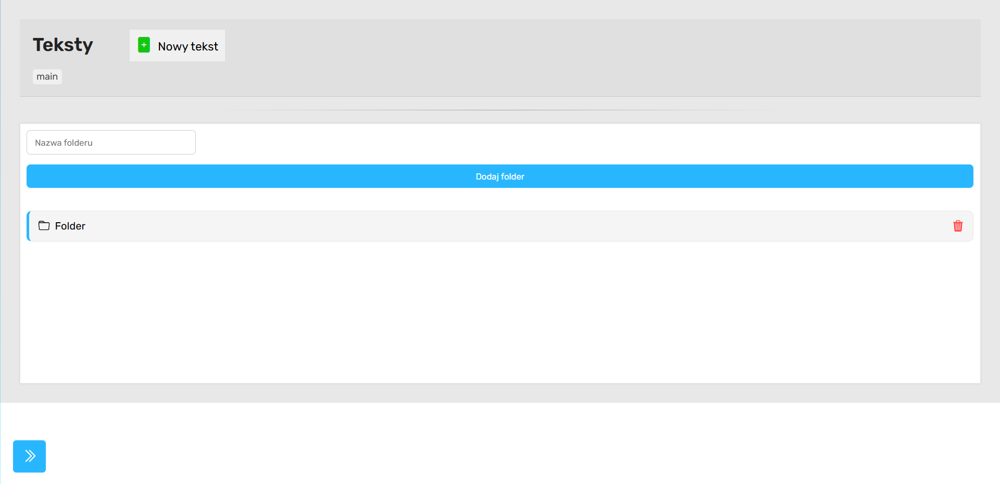

> [Strona Główna](../README.md)

# „Teksty”



## Opis podstrony

Podstrona „Teksty” odpowiada za zarządzanie strukturą folderów oraz tekstów w systemie dashboardu. Moduł działa podobnie do prostego eksploratora plików — użytkownik może:

- tworzyć foldery,
- przechodzić pomiędzy katalogami,
- tworzyć nowe teksty,
- otwierać istniejące teksty,
- usuwać foldery wraz z całą zawartością,
- korzystać z breadcrumbs (ścieżki nawigacyjnej).

Widok bazuje na dynamicznym renderowaniu danych pobieranych z backendu przez API.

---

## Struktura strony

### Sekcja `<head>`

Do strony dołączone są:

#### Biblioteki i style

- Bootstrap Icons
- główny styl aplikacji `style.css`
- style modułu tekstów `teksty.css`
- font Rubik z Google Fonts

```html
<link rel="stylesheet" href="../style.css" />
<link rel="stylesheet" href="teksty.css" />
```

---

## Nawigacja boczna

Element `<aside id="dashboard-navbar">` odpowiada za główne menu dashboardu.

Zawiera linki do:

- Zamówień
- Kalendarza
- Klientów
- Typów zamówień i tagów
- Tekstów
- Galerii

Navbar może być zwijany przyciskiem:

```html
onclick="toggleDashboardNavbar()"
```

Funkcja znajduje się w globalnym pliku `script.js`.

---

## Główna sekcja strony

### Header

Header zawiera:

#### Tytuł strony

```html
<h1 id="page-name">Teksty</h1>
```

#### Przycisk dodawania nowego tekstu

```html
<button id="add-text"></button>
```

Po kliknięciu otwierany jest modal tworzenia nowego tekstu.

#### Breadcrumbs

```html
<nav class="subnav"></nav>
```

Dynamicznie generowana ścieżka aktualnego folderu.

---

## Sekcja główna

### Dodawanie folderów

Użytkownik może wpisać nazwę folderu:

```html
<input type="text" id="folder-name" />
```

oraz utworzyć katalog:

```html
<button id="add-folder-btn">Dodaj folder</button>
```

---

### Drzewo plików

```html
<ul id="tree"></ul>
```

To główny kontener renderujący:

- foldery,
- teksty,
- przycisk powrotu,
- strukturę katalogów.

Cała zawartość generowana jest dynamicznie w JavaScript.

---

## Modal dodawania tekstu

Ukryty overlay:

```html
<div class="overlay hidden" id="new-order-overlay"></div>
```

Zawiera:

- pole nazwy tekstu,
- przycisk dodania,
- przycisk anulowania.

Modal pojawia się po kliknięciu:

```javascript
#add-text
```

---

## Mechanizm autoryzacji

### Funkcja `init()`

```javascript
async function init()
```

Przed załadowaniem danych wykonywane jest sprawdzenie logowania:

```javascript
fetch("../logowanie/api/auth.php");
```

#### Działanie:

- status 401 lub 403 → brak dostępu,
- użytkownik niezalogowany otrzymuje alert,
- przy poprawnej autoryzacji wykonywane jest `loadData()`.

---

## Główna logika aplikacji

### Funkcja `loadData()`

To centralna funkcja całego modułu.

Odpowiada za:

- inicjalizację stanu aplikacji,
- pobieranie danych,
- renderowanie,
- nawigację,
- dodawanie folderów,
- dodawanie tekstów,
- usuwanie folderów.

---

## Parametry URL

### Obsługa folderów

```javascript
const params = new URLSearchParams(window.location.search);
```

Pobierany parametr:

```javascript
id - folderu;
```

Pozwala bezpośrednio wejść do konkretnego katalogu.

---

## Zmienne stanu

### currentParentId

Aktualny otwarty folder.

### path

Tablica breadcrumbs.

Przechowuje historię aktualnej ścieżki.

### allData

Pełna struktura danych pobrana z backendu.

### editingId

Przygotowane pod przyszły system edycji.

Aktualnie nie jest wykorzystywane.

---

## Pobieranie danych

### Funkcja `fetchData()`

```javascript
fetch("api/get_all.php");
```

Backend zwraca pełną strukturę:

- folderów,
- tekstów,
- relacji rodzic-dziecko.

Po pobraniu:

1. dane trafiają do `allData`,
2. budowana jest ścieżka,
3. wykonywany jest render.

---

## Budowanie breadcrumbs

## Funkcja `buildPath(parentId)`

Rekurencyjnie przechodzi po:

```javascript
rodzic_id;
```

aby odtworzyć pełną ścieżkę folderów.

Przykład:

```text
main / Projekty / Klienci / 2025
```

---

## Renderowanie struktury

### Funkcja `render()`

Najważniejsza funkcja wizualna.

Odpowiada za:

- czyszczenie drzewa,
- render folderów,
- render tekstów,
- render przycisku cofania,
- sortowanie elementów,
- podpinanie event listenerów.

---

## Sortowanie elementów

Foldery renderowane są przed tekstami.

Realizowane przez:

```javascript
sorted = [...items].sort(...)
```

Warunek:

```javascript
catalogue;
```

jest traktowany jako folder.

---

## Foldery

Folder renderowany jest jako:

```html
<li class="folder"></li>
```

Zawiera:

- ikonę folderu,
- nazwę,
- przycisk usuwania.

Kliknięcie folderu:

```javascript
enterFolder(item);
```

przechodzi do wnętrza katalogu.

---

## Teksty

Teksty renderowane są jako:

```html
<li class="text"></li>
```

Kliknięcie:

```javascript
openText(item);
```

przekierowuje do:

```text
./tekst/index.php?id=...
```

czyli edytora tekstu.

---

## Nawigacja po folderach

### Wejście do folderu

#### Funkcja `enterFolder(folder)`

Aktualizuje:

- breadcrumbs,
- currentParentId,
- URL.

```javascript
history.pushState();
```

umożliwia zachowanie aktualnego folderu w adresie.

---

### Cofanie

#### Funkcja `goBack(index)`

Usuwa fragment ścieżki:

```javascript
path.slice();
```

oraz renderuje poprzedni katalog.

---

## Breadcrumbs

### Funkcja `renderBreadcrumbs()`

Dynamicznie buduje ścieżkę folderów.

Każdy element breadcrumbs jest klikalny.

Pozwala szybko przejść do dowolnego poziomu.

---

## Dodawanie folderu

### Endpoint

```text
api/add_structure.php
```

### Wysyłane dane

```json
{
  "nazwa": "Folder",
  "rodzic_id": 1,
  "typ": "catalogue"
}
```

Po sukcesie:

- pole input jest czyszczone,
- wykonywany jest refresh danych.

---

## Dodawanie tekstu

### Endpoint

```text
api/add_text.php
```

### Wysyłane dane

```json
{
  "tytul": "Nowy tekst",
  "struktura_id": 1,
  "tresc": ""
}
```

Po poprawnym dodaniu:

- modal zostaje zamknięty,
- dane są odświeżane,
- użytkownik zostaje przekierowany do edytora tekstu.

---

## Usuwanie folderów

### Funkcja `attachDeleteFolderButtons()`

Dodaje event listenery do przycisków usuwania.

Usuwanie wykonywane jest przez:

```javascript
fetch("api/delete_structure.php");
```

---

### Zakres usuwania

Usuwany jest:

- folder,
- wszystkie podfoldery,
- wszystkie teksty znajdujące się wewnątrz.

Jest to usuwanie rekurencyjne.

---

## Overlay i modal

### Zamykanie modala

Kliknięcie poza oknem:

```javascript
if (e.target.id === "new-order-overlay")
```

zamyka overlay.

---

## Obsługa błędów

W kodzie zastosowano:

### Walidację odpowiedzi JSON

```javascript
try {
  JSON.parse(text);
}
```

Chroni przed błędnymi odpowiedziami backendu.

---

### Alerty błędów

Przykłady:

```javascript
alert("Błąd połączenia");
```

```javascript
alert("Błąd dodawania folderu");
```
