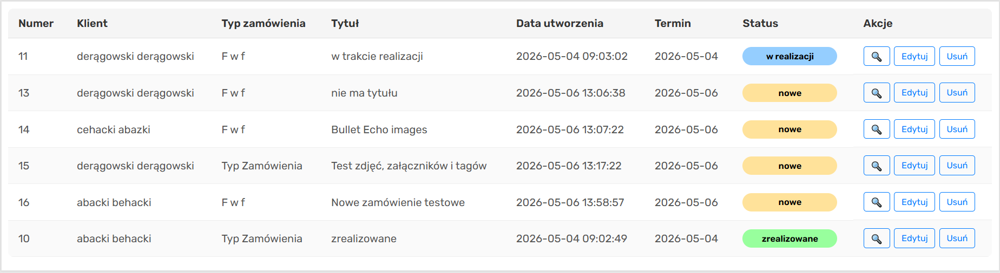
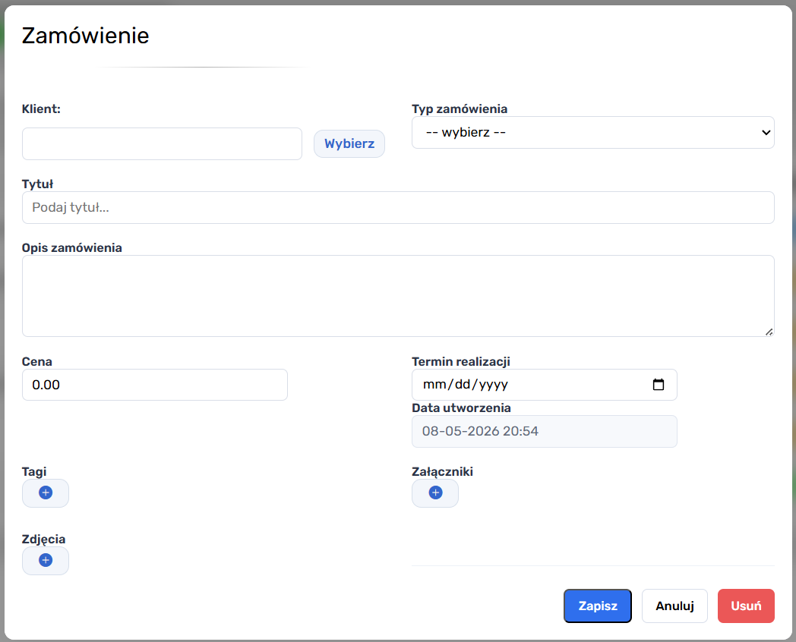
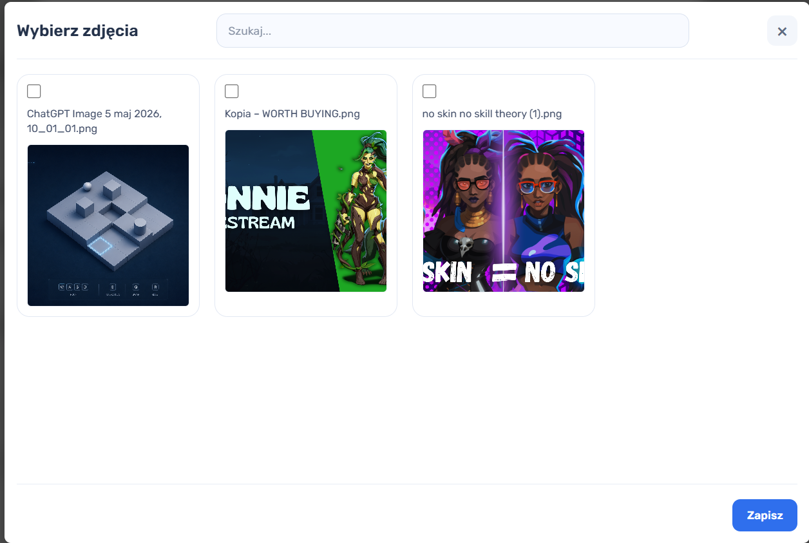
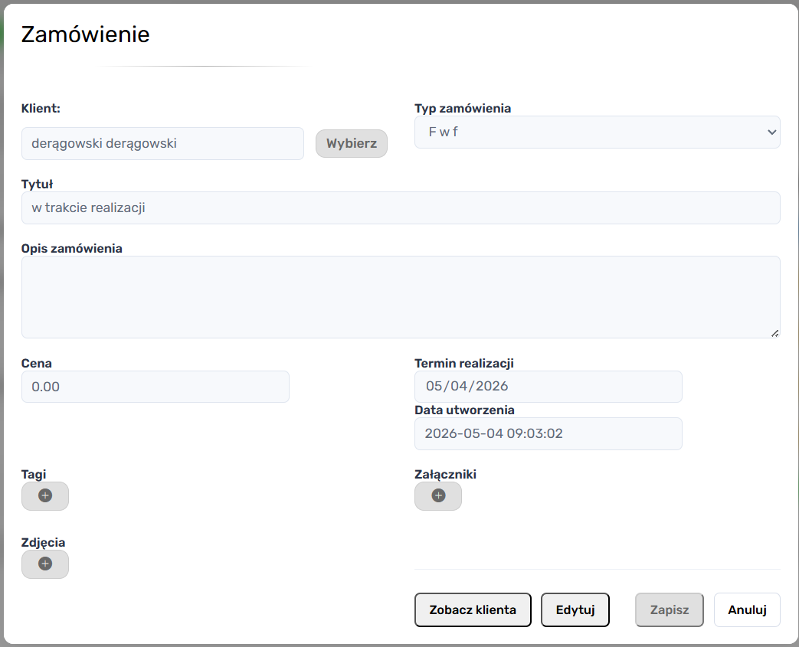

> [Strona Główna](../README.md)

# `zamowienia/index.html`


## 1. Opis pliku

Plik `zamowienia/index.html` odpowiada za główny moduł zarządzania zamówieniami w systemie.

Moduł umożliwia:

- przeglądanie wszystkich zamówień,
- filtrowanie danych,
- dodawanie nowych zamówień,
- edycję istniejących zamówień,
- podgląd szczegółów,
- przypisywanie klientów,
- przypisywanie tagów,
- dodawanie załączników,
- przypisywanie zdjęć,
- zarządzanie statusem zamówień.

---

## 2. Struktura strony

Strona składa się z następujących sekcji:

| Sekcja               | Opis                              |
| -------------------- | --------------------------------- |
| `aside`              | panel nawigacyjny                 |
| `main`               | główna zawartość modułu           |
| `header`             | nagłówek oraz system filtrów      |
| `section#all-orders` | tabela zamówień                   |
| `overlay`            | modal dodawania/edycji zamówienia |
| `client-modal`       | modal wyboru klienta              |
| `photos-showbox`     | modal wyboru zdjęć                |

---

## 4. Tabela zamówień



### Sekcja

```html
<section id="all-orders"></section>
```

odpowiada za prezentację wszystkich zamówień.

### Struktura tabeli

Tabela zawiera kolumny:

| Kolumna         | Opis                              |
| --------------- | --------------------------------- |
| Numer           | identyfikator zamówienia          |
| Klient          | dane klienta                      |
| Typ zamówienia  | typ przypisany do zamówienia      |
| Tytuł           | nazwa zamówienia                  |
| Data utworzenia | data utworzenia wpisu             |
| Termin          | termin realizacji                 |
| Status          | aktualny status                   |
| Akcje           | operacje dostępne dla użytkownika |

---

## 5. System filtrowania


### Filtry

System umożliwia filtrowanie po:

| Filtr             | Opis                    |
| ----------------- | ----------------------- |
| Status            | stan realizacji         |
| Typ               | typ zamówienia          |
| Termin realizacji | filtrowanie po miesiącu |
| Tytuł             | wyszukiwanie tekstowe   |

### Reset filtrów

Przycisk:

```html
<button id="reset-sort"></button>
```

przywraca domyślne ustawienia filtrowania.

---

## 6. Modal dodawania i edycji zamówienia



### Kontener

```html
<div class="overlay hidden" id="new-order-overlay"></div>
```

Modal obsługuje:

- tworzenie nowych zamówień,
- edycję istniejących,
- podgląd szczegółów.

---

## 7. Formularz zamówienia

### Formularz

```html
<form id="new-order-form"></form>
```

zawiera wszystkie dane powiązane z zamówieniem.

---

## 8. Pola formularza

### Dane podstawowe

| Pole              | Opis                     |
| ----------------- | ------------------------ |
| klient            | przypisanie klienta      |
| typ zamówienia    | wybór typu               |
| tytuł             | nazwa zamówienia         |
| opis              | opis szczegółowy         |
| cena              | koszt realizacji         |
| termin realizacji | planowany termin         |
| data utworzenia   | data wygenerowania wpisu |

---

## 9. System tagów

### Sekcja tagów

```html
<div id="tags"></div>
```

umożliwia przypisywanie tagów do zamówienia.

### Modal tagów

```html
<div id="tags-showbox" class="showbox"></div>
```

wyświetla listę dostępnych tagów.

### Obsługa logiki

System zarządzania tagami został wydzielony do pliku:

```text
tags_controller.js
```

---

## 10. System załączników

### Sekcja

```html
<ul id="links"></ul>
```

umożliwia dodawanie linków powiązanych z zamówieniem.

### Modal edycji linków

```html
<div id="links-showbox" class="showbox"></div>
```

umożliwia:

- dodawanie,
- edycję,
- zapis linków.

### Dane załącznika

| Pole   | Opis        |
| ------ | ----------- |
| Tytuł  | nazwa linku |
| Źródło | adres URL   |

### Obsługa logiki

Za zarządzanie linkami odpowiada:

```text
links_controller.js
```

---

## 11. System zdjęć



### Sekcja zdjęć

```html
<div id="photos-selected"></div>
```

przechowuje aktualnie przypisane zdjęcia.

### Modal galerii

```html
<div id="photos-showbox"></div>
```

umożliwia wybór zdjęć z galerii systemowej.

### Funkcje modułu

- wyszukiwanie zdjęć,
- wybór wielu pozycji,
- przypisywanie zdjęć do zamówienia.

### Obsługa logiki

Za system zdjęć odpowiada:

```text
photos.js
```

---

## 12. Modal wyboru klienta

### Sekcja

```html
<div id="client-modal"></div>
```

umożliwia wybór klienta z listy.

### Funkcjonalności

- wyszukiwanie klientów,
- sortowanie,
- przypisywanie klienta,
- usuwanie wyboru.

### Tabela klientów

Tabela prezentuje:

- ID klienta,
- imię i nazwisko,
- akcję wyboru.

### Obsługa logiki

Za logikę klientów odpowiada:

```text
clients_controller.js
```

---

## 13. Podział logiki na kontrolery

System wykorzystuje modularną architekturę JavaScript.

### Wykorzystane moduły

| Plik                        | Odpowiedzialność       |
| --------------------------- | ---------------------- |
| `orders.js`                 | główna logika modułu   |
| `clients_controller.js`     | obsługa klientów       |
| `tags_controller.js`        | obsługa tagów          |
| `links_controller.js`       | obsługa załączników    |
| `orders_controller.js`      | operacje CRUD zamówień |
| `order_types_controller.js` | typy zamówień          |
| `photos.js`                 | obsługa galerii        |

---

## 14. Mechanizm autoryzacji

### Funkcja inicjalizacyjna

```javascript
async function init()
```

sprawdza autoryzację użytkownika.

### Endpoint

```text
../logowanie/api/auth.php
```

### Obsługiwane przypadki

| Kod HTTP | Działanie        |
| -------- | ---------------- |
| 401      | brak dostępu     |
| 403      | konto nieaktywne |
| 200      | dostęp przyznany |

---

## 15. Inicjalizacja modułów

Po poprawnej autoryzacji uruchamiane są moduły:

```javascript
loadLinksController();
loadPhotosController();
loadClientsController();
loadTagsController();
loadOrdersController();
```

Następnie ładowane są dane zamówień:

```javascript
await loadOrders();
```

---

## 16. Tryb podglądu (`view only`)



System obsługuje tryb tylko do odczytu.

### Mechanizm

Tryb aktywowany jest parametrem URL:

```text
?isViewOnly=true
```

### Funkcja

```javascript
applyViewMode();
```

sprawdza obecność parametru i blokuje formularz.

---

## 17. Blokowanie formularza

### Funkcja

```javascript
setFormDisabled((disabled = true));
```

odpowiada za:

- blokowanie pól formularza,
- blokowanie przycisków,
- ukrywanie przycisku usuwania.

#### Wyjątki

Niektóre przyciski pozostają aktywne:

- anulowanie,
- zamknięcie modali.

---

## 18. Formatowanie dat

### Funkcja

```javascript
formatDatePL(date);
```

konwertuje datę do polskiego formatu:

```text
DD-MM-RRRR HH:MM
```
